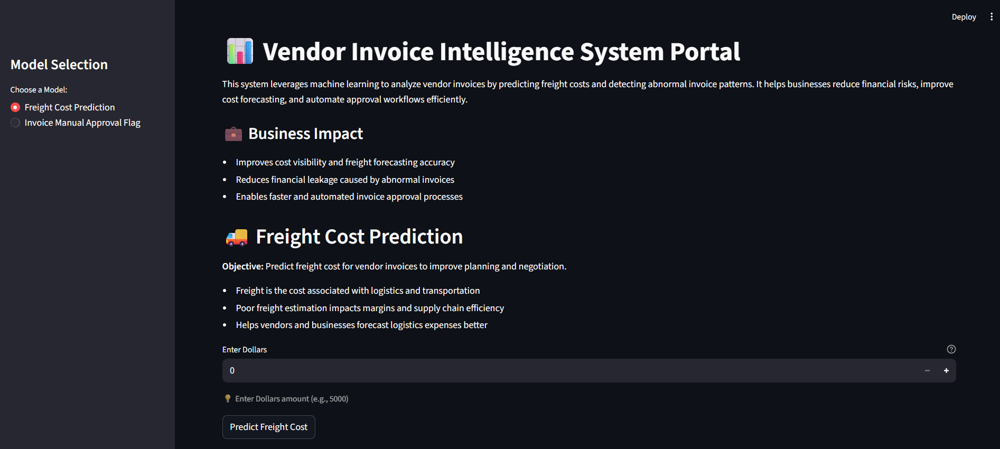
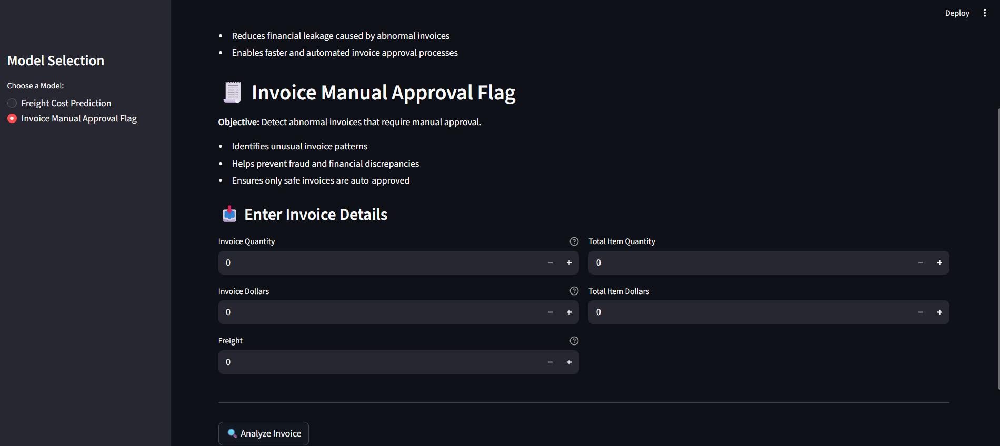
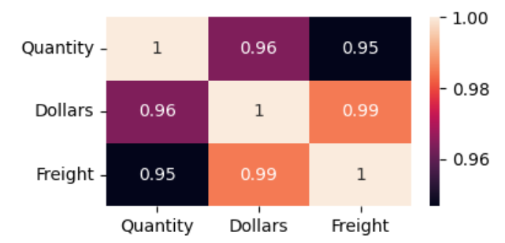
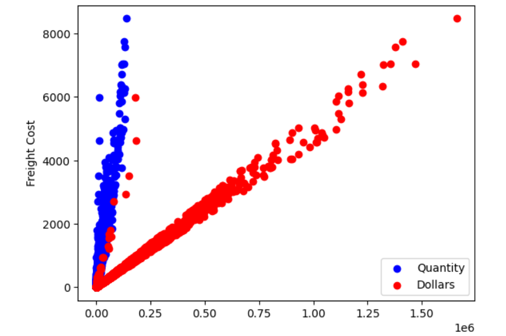
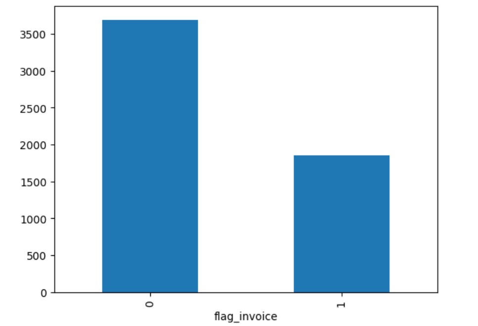

# Vendor Invoice Intelligence System

**Freight Cost Prediction & Invoice Risk Flagging**

## 📌Table of Contents

- <a href="#project-overview">Project Overview </a>
- <a href="#business-objectives">Business Objectives </a>
- <a href="#data-sources">Data Sources </a>
- <a href="#eda">Exploratory Data Analysis </a>
- <a href="#models-used">Models Used </a>
- <a href="#metrics">Evaluation Metrics </a>
- <a href="#application">Application </a>
- <a href="#project-structure">Project Structure </a>
- <a href="#how-to-run-this-project">How to Run This Project </a>
- <a href="#author--contact">Author & Contact </a>

---


<h2><a class="anchor" id="project-overview"></a>📌Project Overview</h2>

This project implements an **end-to-end machine learning system** designed to support finance teams by:

1. **Predicting expected freight cost** for vendor invoices.
2. **Flagging high-risk invoices** that require manual review due to abnormal cost, freight, or operational patterns.

---


<h2><a class="anchor" id="business-objectives"></a>🎯Business Objectives</h2>

### 1. Freight Cost Prediction (Regression)

**Objective**: Predict freight cost for a vendor invoice using quantity and dollars, to improve cost forecasting, budgeting, and vendor negotiation.

Why it matters:

- Freight is a non-trivial component of landed cost.
- Poor freight estimates distort margin and inventory planning.
- Automating freight estimation helps procurement teams forecast true cost before invoice arrival.



---


### 2. Invoice Risk Flagging(Classification)

**Objective**: Predict whether a vendor invoice should be flagged for manual approval based on abnormal cost freight, or delivery patterns, in order to reduce financial risk, improve operational efficiency, and pritorize human review where it adds the most value.

why it matters:

- Manual invoice review is time-consuming and does not scale with transaction volume.
- Abnormal freight charges, pricing deviations, or delivery delays often indicate errors, disputes, or compliance risks.
- An automated flagging system enables finance teams to focus attention on high-risk invoices while allowing low-risk invoices to be processed automatically.



---


<h2><a class="anchor" id="data-sources"></a>📂Data Sources</h2>

Data is stored in a relational SQLite database (inventory.db) with the following tables:

- vendor_invoice - invoice-level financial and timing data
- purchases - item-level purchase details
- purchase_prices - Reference purchase prices
- begin_inventory, end_inventory - inventory snapshots

SQL aggregation is used to generate invoice-level features.

---


<h2><a class="anchor" id="eda"></a>📊Exploratory Data Analysis</h2>

EDA focuses on business-driven questions, such as:

- Do flagged invoices have higher financial exposure?
- Does freight scale linearly with quantity?
- Does freight cost depend on quantity?

For Freight Cost Prediction, Correlation was checked to determine the best feature.




For Invoice Flagging System, count of target variable was checked for imbalance data

Statistical tests (t-test) are used to confirm that flagged invoices differ meaningfully from normal invoices.

---


<h2><a class="anchor" id="models-used"></a>🤖Models Used</h2>

**Regression (Freight Prediction)**

- Linear Regression (baseline)
- Decision Tree Regressor
- Random Forest Regressor (final model)

**Classification (Invoice Flagging)**

- Logistic Regression(baseline)
- Decision Tree Classifier
- Random Forest Classifier (final model with GridSearchCV)

Hyperparameter tuning is performed using **GridSearchCV** with F1-score to handle class imbalance.

---


<h2><a class="anchor" id="metrics"></a>📈Evaluation Metrics</h2>

**Freight Prediction**

- MAE
- RMSE
- R2 Score

 **Invoice Flagging**

- Accuracy
- Precision, Recall, F1-score
- Classification report

---


<h2><a class="anchor" id="application"></a>🖥️End to End Application</h2>

A streamlit application demonstrates the complete pipeline:

- input invoice details
- Predict expected freight
- Flag invoices in real time
- Provide human-readable explanations

---


<h2><a class="anchor" id="project-structure"></a>📂Project Structure</h2>

```
invoice-intelligence-system/
│
├── app.py
│
├── data/
│   └── inventory.db
│
├── models/
│   ├── predict_freight_model.pkl
│   └── predict_invoice_flag_model.pkl
│
├── inference/
│   ├── predict_freight.py
│   └── predict_invoice_flag.py
│
├── data_preprocessing.py
├── model_evaluation.py
├── train_model.py
│
└── README.md
```

---


<h2><a class="anchor" id="`how-to-run-this-project`"></a>How to run this project</h2>

1. Clone the repository:

   ```
   git clone https://github.com/Submich/invoice-intelligence-system.git
   ```
2. Install the libraries:
   ```
   pip install -r requirements.txt
   ```
3. Train and Save the Best Fit Models:

   ```
   python freight_cost_prediction/train.py
   python invoice_flagging/train.py
   ```
4. Test Models:

   ```
   python inference/predict_freight.py
   python inference/predict_invoice_flag.py
   ```
5. Open Application:

   ```
   streamlit run app.py
   ```


---


<h2><a class="anchor" id=`author--contact`></a>Author & Contact</h2>

Mohammed Safwan Shawn

Data Scientist

✉️Email: safwanshawn@gmail.com

[LinkedIn](https://www.linkedin.com/in/safwan-shawn-mohammed/)
